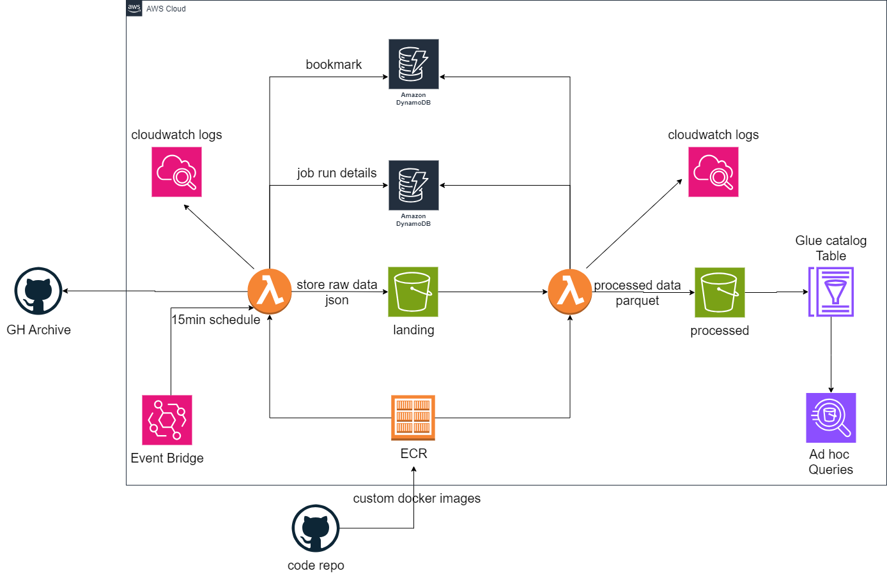

# Serverless ELT Pipeline

## Overview

This repository contains the source code and documentation for a serverless ELT (Extract, Load, Transform) pipeline implemented using AWS services. The project focuses on ingesting data from `GHArchive`, performing scheduled data transformations, and storing the results in S3 for further analysis.

## Architecture




## Project Workflow

1. **Baseline Day Setup:**
   - Set the baseline day to a specified date in `jobs` table in DynamoDB, e.g., 3 days before the current date.

2. **IAM Role Creation:**
   - Create an IAM role providing access to S3, CloudWatch Logs, and DynamoDB.

3. **Data Ingestion:**
   - The Lambda function `lambda_ingest` download files from GHArchive's hourly endpoint.
   - DynamoDB tracks downloaded files, acting as a bookmark.
   - CloudWatch Logs are used for testing data ingestion and monitoring.

4. **Raw Data Storage:**
   - Store raw JSON data in an S3 bucket.

5. **Data Transformation:**
   - `lambda_transform_trigger` performs data cleaning and transformation.
   - Transformation includes flattening JSON, removing duplicates, and unwanted columns.
   - Data is chunked into sets of 10,000 records for processing efficiency.
   - Transformed data is stored in S3 as Snappy-compressed Parquet, partitioned by date.
   - CloudWatch Logs are used for testing data transformation and monitoring.

6. **DynamoDB Updates:**
   - Update job details in `jobs` table and run details in `job_run_details` table.

7. **Lambda Deployment Automation:**
   - The `docker_build.sh` script automates building, tagging, and pushing Docker images to ECR.
   - Lambda functions are updated to use the latest Docker image directly from ECR.

8. **Glue Crawler Setup:**
   - Configure AWS Glue Crawler to create a catalog table based on transformed data in S3.

9. **Athena Querying:**
   - Use Athena to run ad hoc queries on the data cataloged by Glue.

## Project Structure

- **`/infra` Folder:**
  - Contains shell script to initialize the setup for this project.

- **`/app` Folder:**
  - Contains Lambda function code for data ingestion and transformation.

- **`docker_build.sh` Script:**
  - Automates Docker image build and deployment.

## Getting Started

1. **IAM Role Configuration:**
   - Create an IAM role for Lambda with appropriate permissions.

2. **Baseline Day Configuration:**
   - Update the baseline day in DynamoDB `jobs` table.

3. **AWS Setup:**
   - Configure AWS credentials and permissions for Lambda, DynamoDB, S3, ECR, Glue, Athena, and CloudWatch Logs.
  
4. **Local Development Setup:**
   - To set up and run this project, follow these steps
     
   ```bash
   git clone https://github.com/aravindhKumaran/serverless-ELT.git
   cd serverless-ELT/infra
   ./init.sh
   ```

6. **Lambda Deployment:**
   - Execute the `docker_build.sh` script to build, tag, and push Docker images to ECR.
   - Update Lambda functions in the `/app` folder to use the latest Docker image.

7. **Scheduled Execution:**
   - Set up EventBridge rules to trigger Lambda functions at the desired schedule.

8. **Data Analysis:**
   - Use Athena to run ad hoc queries on processed data cataloged by Glue.

9. **Monitoring:**
   - Leverage CloudWatch Logs for testing data ingestion, transformation, and monitoring.

## Dependencies

- AWS Lambda
- AWS DynamoDB
- AWS S3
- AWS EventBridge
- AWS Glue
- AWS Athena
- Amazon ECR
- Docker
- CloudWatch Logs

## Notes

- Ensure proper AWS IAM roles and policies are configured for Lambda functions.
- Regularly update Docker image and Lambda functions as needed.
- CloudWatch Logs can be useful for monitoring and testing data flow through the pipeline.

This readme.md provides an overview of the project architecture, workflow, and setup instructions. Refer to specific code files for detailed implementations.


